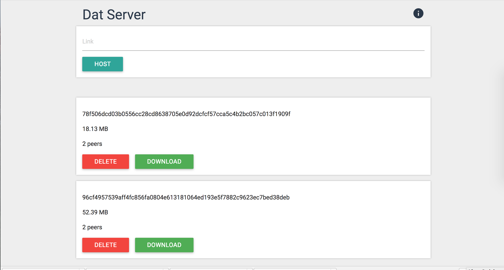

# dat-server

A web interface for managing [dat repositories](http://dat-data.com) on a remote server.



## Installation

1. Clone this repository and install dependencies.

```
git clone https://github.com/karissa/dat-server.git
cd dat-server
npm install
```

2. Create the config

Pay attention to where downloaded dats will be stored. Edit the `location` field so that it suits your setup.

```
cp example.config.json config.json
```

3. Build assets and run the app.

```
npm start
```


# API

### Main screen

GET `/`

Frontend index.html. Lists the currently hosted dats, with stop/start button. Can add a new dat.

### List dats

GET `/dats`

A list of currently deployed dats in JSON format.

Options

- `format`: supply ?format=<ndjson,json,csv> to format the return.

###  Get info for a given dat.

GET `/dats/:name`

Returns:
```
{
  "name": "politicaltweets",
  "link": "dat://thisisalink",
}
```

## Authenticated methods:

Don't worry about it now but at some point we need authentication.

Maybe just http basic auth.

### Start a dat

GET `/dats/:name/start`

Example:

```
curl http://dats.berkeley.edu/dats/mydat/start?link=thisisadathash
```

Could return download progress. (not that important)

```
{ "progress": 30 }
{ "progress": 100 }
{ "progress": 403 }
```

### Stop a dat

GET `/dats/:name/stop`

### Delete a dat

DELETE `/dats/:name`

Delete a dat, removing all data. It's gone. NADA!

Returns `{ deleted: true }` if successful.
